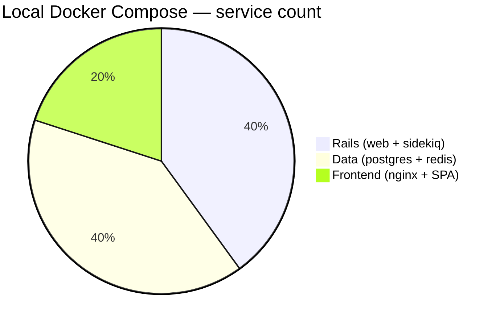
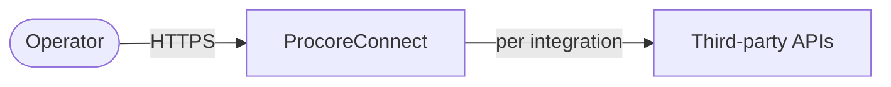
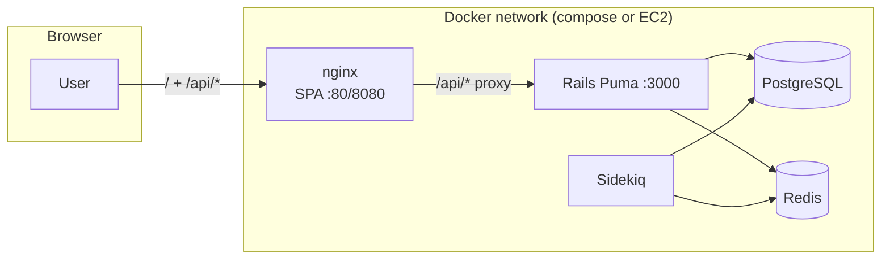
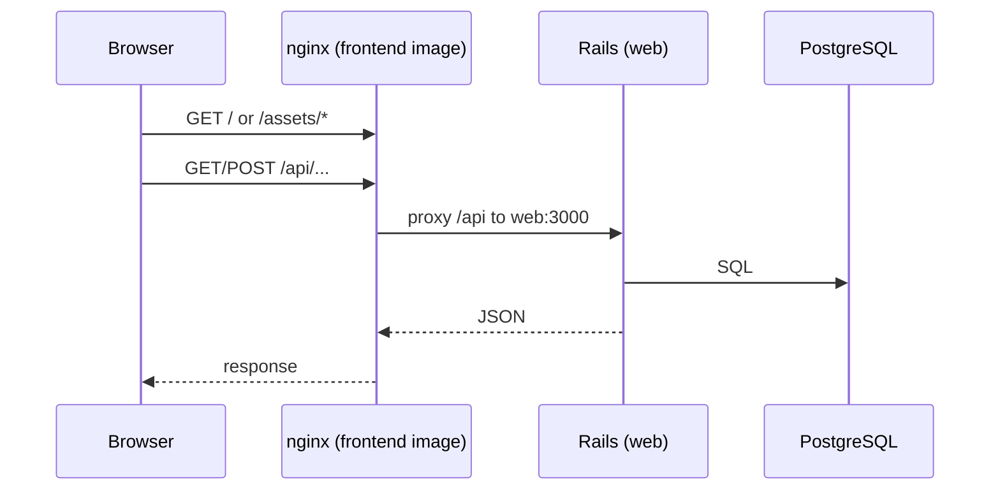
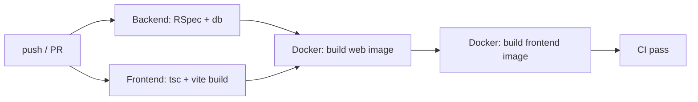

# ProcoreConnect

**Author:** Kester Nkese

**ProcoreConnect** is an **integration platform** for connecting internal systems to **third-party HTTP APIs** with a **first-party dashboard**: users define **integrations** (endpoints, credentials, status), run **syncs**, review **sync logs**, and accept **signed webhooks** for real-time events. The stack is a **Ruby on Rails 7+ API** with **Active Record encryption** for sensitive fields, a **Sidekiq** job layer, a **React (Vite + TypeScript) SPA** served by **nginx**, and **PostgreSQL** + **Redis**.

This repository is a **monorepo**: `procoreconnect/` (Rails) and `procoreconnect/client/` (frontend), with **Docker Compose** for a production-shaped local run and **CI** on GitHub Actions. A separate **`infrastructure/aws/`** path documents a lean **AWS** “Path A” deploy (EC2 + RDS + ECR) without a shared ALB.

---

## At a glance

| Layer | Technology |
|--------|------------|
| **API** | Ruby on Rails, Puma, JWT, encrypted attributes |
| **Jobs** | Sidekiq → Redis |
| **Data** | PostgreSQL 16, Active Record, migrations |
| **UI** | React 18, Vite, TypeScript, Tailwind-style tokens |
| **Local orchestration** | Docker Compose (multi-service) |
| **CI** | RSpec, `npm run build`, Docker image builds (no ECR push) |
| **Docs** | `infrastructure/aws/path-a-runbook.txt` (AWS walkthrough) |



---

## System context



*(Logical view: one deployment may split SPA/API/DB as in the diagrams below.)*

---

## Container architecture (local / Path A)



On **Path A (AWS)**, PostgreSQL is often **Amazon RDS**; the same diagram applies with `PG` outside Docker. **ECR** hosts the **web** and **frontend** images; a small **redis** service typically runs in Compose on the host.

---

## Request path (simplified)



---

## CI pipeline (high level)



Defined in [`.github/workflows/ci.yml`](.github/workflows/ci.yml). Images are **built** for regression only; **pushing to a registry** is a manual or separate release step.

---

## Repository layout

| Path | Purpose |
|------|---------|
| `procoreconnect/` | Rails app: models (`Integration`, `User`, `SyncLog`, `WebhookEvent`), API, `Dockerfile` |
| `procoreconnect/client/` | Vite + React SPA, `Dockerfile` (Node build → nginx runtime) |
| `docker-compose.yml` | **Local** full stack: Postgres, Redis, web, Sidekiq, frontend |
| `infrastructure/aws/` | **Path A** scripts: EC2, RDS, ECR, `docker-compose.path-a.yml`, runbook |
| `.env.docker.example` | **Template** for root `.env` (copy → `.env` before `docker compose up`) |

Core domain (Rails):

- **Integration** — third-party `api_endpoint`, **encrypted** `api_key`, status (`active` / `paused` / `error`), per-integration **webhook secret** and HMAC verification.
- **SyncLog** / **WebhookEvent** — traceability and auditing around sync and inbound hooks.

---

## Local development (Docker — recommended)

**Prerequisites:** [Docker](https://docs.docker.com/get-docker/) + [Docker Compose v2](https://docs.docker.com/compose/) (or plugin).

1. **Clone** the repository and `cd` to the repo root.

2. **Secrets:** copy the example and fill in real values (see table below).
   ```bash
   cp .env.docker.example .env
   ```
3. **Generate** Rails and encryption material from `procoreconnect/`:
   ```bash
   cd procoreconnect
   bundle install
   bundle exec rails secret          # use for SECRET_KEY_BASE and a second run for JWT_SECRET
   bundle exec rails db:encryption:init
   cd ..
   ```
4. **Run:**
   ```bash
   docker compose up --build
   ```
5. **URLs (defaults):** SPA + API proxy: **http://localhost:8080** — Rails only: **http://localhost:3000** — Postgres (host): **localhost:5433** (see `POSTGRES_PORT`).

### What belongs in `.env` (and how it maps)

| Variable | Role |
|----------|------|
| `POSTGRES_*` | Database **container** credentials; compose maps `POSTGRES_PASSWORD` into both `DATABASE_PASSWORD` and `PROCORECONNECT_DATABASE_PASSWORD` for the Rails services. |
| `SECRET_KEY_BASE` / `JWT_SECRET` | Cryptographic and session security; use **strong unique** values (`rails secret`, two different outputs). |
| `AR_ENCRYPTION_*` (three keys) | **Active Record** non-deterministic/deterministic encryption; must match `db:encryption:init` for new installs. |
| `CORS_ORIGINS` | Browser **Origin** allowed to call the API (e.g. `http://localhost:8080` when the SPA is there). |
| `WEB_PORT` / `FRONTEND_PORT` | **Host** port publishing for the web and frontend containers. |

**Production** (`RAILS_ENV=production`) does **not** use development fallbacks in [`active_record_encryption.rb`](procoreconnect/config/initializers/active_record_encryption.rb) — the three `AR_ENCRYPTION_*` keys are **required**.

For **Path A on AWS** (EC2 + RDS), use `infrastructure/aws/env.path-a.example` as a template for a **separate** `.env` on the server (not this file, which is Postgres-in-Docker).

---

## AWS (Path A)

A minimal “portfolio-lean” path: **t3.micro EC2**, **RDS PostgreSQL**, **ECR** images, **no ALB** in the baseline. See:

- [`infrastructure/aws/path-a-runbook.txt`](infrastructure/aws/path-a-runbook.txt)
- **Compose override for on-box run:** `infrastructure/aws/docker-compose.path-a.yml` + `.env` next to it (RDS + Redis container + ECR-tagged images).

**Never commit:** `.pem`, `infrastructure/aws/.rds-creds.local`, or any file containing live DB passwords or AWS keys. Root [`.gitignore`](.gitignore) covers common cases.

---

## Security notes

- **Secrets** live in environment (or a secrets manager in real production), not in the repo.
- **Integration `api_key`** and similar fields use **Active Record encryption** in the database.
- **Webhooks** use a per-integration **secret** and **HMAC-SHA256** (constant-time compare) for signature verification.
- **JWT**-based API auth for the dashboard/API as implemented in the app; rotate `JWT_SECRET` and `SECRET_KEY_BASE` on any leak.

---

## License

Copyright © Kester Nkese. Add a **license** file (e.g. MIT, Apache-2.0, or proprietary) when you publish; until then, all rights reserved unless you state otherwise in a `LICENSE` file at the repository root.

---

## Glossary

| Term | Meaning |
|------|--------|
| **Path A** | Single-EC2 + RDS + ECR style deploy described under `infrastructure/aws/` |
| **SPA** | Single-page app (React), served from nginx, `/api` proxied to Rails |
| **Sync** | Application-defined job that talks to a third-party API and records outcomes in `sync_logs` |

For deep implementation details, start with `procoreconnect/config/routes.rb`, `app/models/integration.rb`, and the client’s `src/` API layer.
